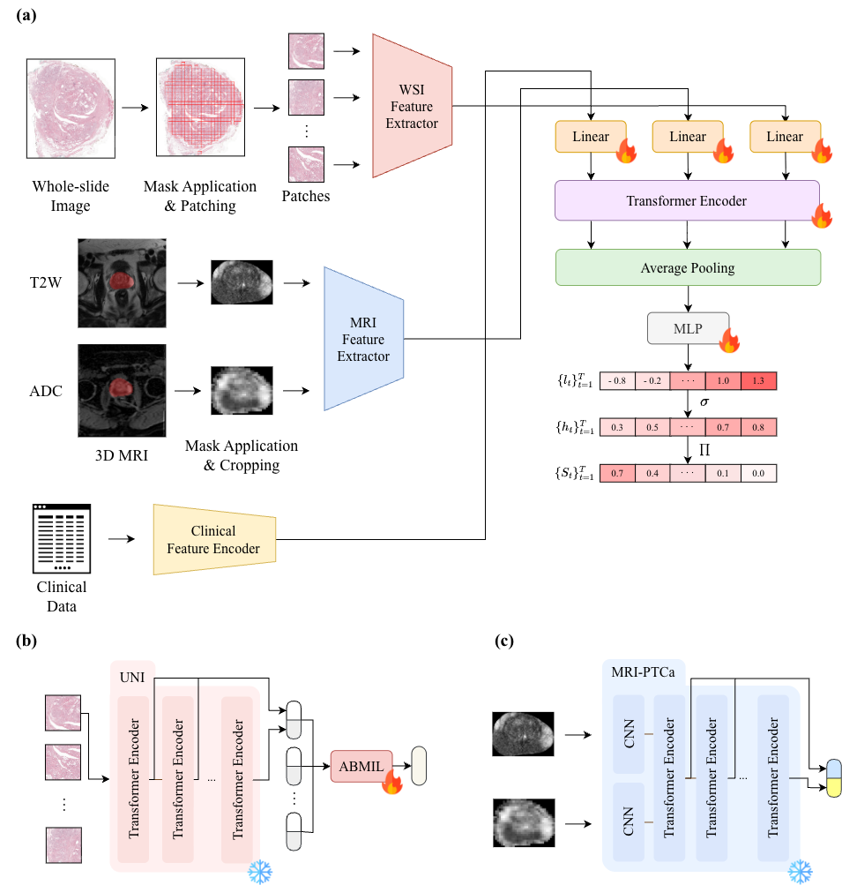

# HIMF-Surv

This repository is the official implementation of Hierarchical Intra- and Inter-Modality Fusion for Multimodal Survival Prediction in Prostate Cancer.

## Model Overview




## Environments and Requirements

- **OS**: Ubuntu
- **Python**: 3.11.4
- **CUDA**: 12.6
- **CPU**: AMD EPYC 9654
- **GPU**: NVIDIA H100 SXM

To install requirements:

```bash
pip install -r requirements.txt
```

## Dataset

The dataset can be downloaded using the following command:

```bash
aws s3 sync --no-sign-request s3://chimera-challenge/v2/task1/ <destination_path>
```

**Folder structure:**

```
task1/
├── clinical_data/
│   └── <patient_id>.json
├── pathology/
│   ├── features/
│   └── images/
│       └── <patient_id>/
│           ├── <patient_id>_<scan_id>.tif
│           └── <patient_id>_<scan_id>_tissue.tif
└── radiology/
    ├── features/
    └── images/
        └── <patient_id>/
            ├── <patient_id>_<scan_id>_t2w.mha
            ├── <patient_id>_<scan_id>_adc.mha
            └── <patient_id>_<scan_id>_mask.mha
```

For feature extraction scripts, you can reference the paths as:
- WSI data: `<destination_path>/pathology/images/`
- mpMRI data: `<destination_path>/radiology/images/`
- Clinical data: `<destination_path>/clinical_data/`

## Feature Extraction

### WSI Feature Extraction

Extract WSI features using the UNI model. The extraction process consists of two steps:
1. Extract all intermediate layer features from the UNI model
2. Aggregate features using layer configuration [0.5, 0.75, 1.0] with group_mean aggregation

**Prerequisites:**

Before running WSI feature extraction, you must log in to HuggingFace to access the UNI model. Choose one of the following methods:

```bash
# Method 1: Use HuggingFace CLI (recommended)
huggingface-cli login

# Method 2: Set environment variable
export HF_TOKEN=your_token_here

# Method 3: Use Python
python -c "from huggingface_hub import login; login()"
```

**Required arguments:**
- `--wsi_dir`: Directory containing WSI data files (expected structure: `wsi_dir/patient_id/patient_id_scan_id.tif`, `patient_id_scan_id_tissue.tif`)
- `--raw_feature_dir`: Directory to save raw layer features from step 1
- `--aggregated_feature_dir`: Directory to save aggregated features from step 2

**Optional arguments:**
- `--device`: Device to use for computation - `auto`, `cpu`, or `cuda` (default: `auto`)
- `--num_workers_extract`: Number of workers for layer extraction (default: 1, use 1 for GPU)
- `--num_workers_aggregate`: Number of workers for aggregation (default: 4, can use more for CPU-bound tasks)

**Example usage:**

```bash
python feature_extractors/wsi.py \
    --wsi_dir /path/to/wsi/data \
    --raw_feature_dir /path/to/raw/features \
    --aggregated_feature_dir /path/to/aggregated/features \
    --device cuda \
    --num_workers_extract 1 \
    --num_workers_aggregate 4
```

**Output files:**
- Raw features: `{wsi_id}_all_layers.npy` in `raw_feature_dir` (shape: `(N, L, D)` where N is number of patches, L is number of layers, D is feature dimension)
- Aggregated features: `{wsi_id}_agg_layers.npy` in `aggregated_feature_dir` (shape: `(N, G, D)` where N is number of patches, G is number of groups (2), D is feature dimension)

### mpMRI Feature Extraction

Extract mpMRI features using the MRI-PTCa model. The extraction process consists of two steps:
1. Extract all intermediate layer features from the ViT model
2. Aggregate features using layer configuration [0.5, 0.75, 1.0] with group_mean aggregation

**Pretrained weights:**

Pretrained model weights for MRI-PTCa can be downloaded from the [original repository](https://github.com/StandWisdom/MRI-based-Predicted-Transformer-for-Prostate-cancer/tree/main/pretrained_weights). You will need:
- T2 extractor model weights (`t2_model.pth`)
- ADC extractor model weights (`adc_model.pth`)
- ViT fusion model weights (`vit_model.pth`)

**Required arguments:**
- `--mri_dir`: Directory containing MRI data files (expected structure: `mri_dir/patient_id/patient_id_scan_id_t2w.mha`, `patient_id_scan_id_adc.mha`, `patient_id_scan_id_mask.mha`).
- `--raw_feature_dir`: Directory to save raw layer features from step 1
- `--aggregated_feature_dir`: Directory to save aggregated features from step 2

**Optional arguments:**
- `--t2_model_path`: Path to T2 extractor model weights (default: None)
- `--adc_model_path`: Path to ADC extractor model weights (default: None)
- `--vit_model_path`: Path to ViT fusion model weights (default: None)
- `--device`: Device to use for computation - `auto`, `cpu`, or `cuda` (default: `auto`)
- `--num_workers_extract`: Number of workers for layer extraction (default: 1, use 1 for GPU)
- `--num_workers_aggregate`: Number of workers for aggregation (default: 4, can use more for CPU-bound tasks)

**Example usage:**

```bash
python feature_extractors/mri.py \
    --mri_dir /path/to/mri/data \
    --raw_feature_dir /path/to/raw/features \
    --aggregated_feature_dir /path/to/aggregated/features \
    --t2_model_path /path/to/t2_model.pth \
    --adc_model_path /path/to/adc_model.pth \
    --vit_model_path /path/to/vit_model.pth \
    --device cuda \
    --num_workers_extract 1 \
    --num_workers_aggregate 4
```

**Output files:**
- Raw features: `{mri_id}_all_layers.npy` in `raw_feature_dir` (shape: `(L, D)` where L is number of layers, D is feature dimension)
- Aggregated features: `{mri_id}_agg_layers.npy` in `aggregated_feature_dir` (shape: `(G, D)` where G is number of groups (2), D is feature dimension)


### Clinical Feature Extraction

Preprocess clinical data from JSON files into fixed-size embedding vectors.

**Required arguments:**
- `--input_dir`: Directory containing JSON files with clinical data.
- `--output_dir`: Directory to save clinical embedding .npy files

**Example usage:**

```bash
python feature_extractors/clinical.py \
    --input_dir /path/to/clinical/json/files \
    --output_dir /path/to/clinical/embeddings
```

**Output files:**
- Clinical embeddings: `{patient_id}_embedding.npy` in `output_dir` (shape: `(22,)`)

## Training

**Prerequisites:**

If you want to use Weights & Biases (wandb) for experiment tracking, you must log in first. Choose one of the following methods:

```bash
# Method 1: Use wandb CLI (recommended)
wandb login

# Method 2: Set environment variable
export WANDB_API_KEY=your_api_key_here

# Method 3: Use Python
python -c "import wandb; wandb.login()"
```

**Configuration:**

All training settings are configured via a JSON config file. Create or modify `configs/train_config.json` with your paths and hyperparameters.

**Required config fields:**
- `wsi_feature_dir`: Directory containing WSI aggregated feature files
- `mri_feature_dir`: Directory containing MRI aggregated feature files
- `clinical_feature_dir`: Directory containing clinical embedding feature files
- `labels_file`: Path to CSV file with patient labels and fold assignments. The CSV should contain columns: `patient_id`, `time_to_follow-up/BCR`, `BCR`, `fold`.
- `wsi_feature_dim`, `mri_feature_dim`, `clinical_feature_dim`: Feature dimensions
- `num_time_bins`: Number of time bins for survival prediction
- `batch_size`: Batch size for training
- `epochs`: Number of training epochs
- `checkpoint_dir`: Directory to save model checkpoints
- `early_stopping_patience`: Number of epochs to wait before early stopping
- `early_stopping_min_delta`: Minimum change to qualify as an improvement for early stopping

**Optional config fields:**
- `learning_rate`: Learning rate for optimizer (default: 1e-4)
- `weight_decay`: Weight decay for optimizer (default: 0.01)
- `wandb_project`: Weights & Biases project name (default: "HIMF-Surv")
- `wandb_run_name`: Weights & Biases run name (default: "initial run")
- `output_file`: Path to save training results JSON (default: `results/train_results.json`)

**Command line arguments:**
- `--config`: Path to config JSON file (default: `configs/train_config.json`)

**Example usage:**

1. Run training with default config file:

```bash
python train.py
```

2. Run training with custom config file:

```bash
python train.py --config configs/my_train_config.json
```

**Pretrained models:**

You can download trained model checkpoints [here](https://huggingface.co/yws0322/HIMF-Surv). Each fold's checkpoint is saved as `fold_{fold}_best_val_cindex.ckpt`.

## Inference

**Configuration:**

All inference settings are configured via a JSON config file. Create or modify `configs/inference_config.json`.

**Required config fields:**
- `checkpoint_path`: Path to checkpoint file (.ckpt)
- `wsi_feature_dir`: Directory containing WSI aggregated feature files
- `mri_feature_dir`: Directory containing MRI aggregated feature files
- `clinical_feature_dir`: Directory containing clinical embedding feature files
- `labels_file`: Path to CSV file with patient labels. The CSV must contain a `patient_id` column. If ground truth labels (`time_to_follow-up/BCR` and `BCR` columns) are available, C-index calculation will be automatically performed.
- `wsi_feature_dim`, `mri_feature_dim`, `clinical_feature_dim`: Feature dimensions
- `num_time_bins`: Number of time bins for survival prediction

**Optional config fields:**
- `output_file`: Path to save predictions as JSON (default: `results/inference_results.json`)
- `batch_size`: Batch size for inference (default: 8)
- `device`: Device to use - `auto`, `cpu`, or `cuda` (default: `auto`)
- `learning_rate`: Learning rate (default: 1e-4, used when loading checkpoint)
- `weight_decay`: Weight decay (default: 0.01, used when loading checkpoint)

**Command line arguments:**
- `--config`: Path to config JSON file (default: `configs/inference_config.json`)

**Example usage:**

1. Run inference with default config file:

```bash
python inference.py
```

2. Run inference with custom config file:

```bash
python inference.py --config configs/my_inference_config.json
```

**Output format:**

The inference script saves predictions as a JSON file with the following structure:

```json
[
  {
    "c_index": 0.7234,
    "num_patients": 19,
    "num_events": 6
  },
  {
    "patient_id": "1003",
    "risk": -6.23,
    "expected_time": 6.23,
    "survival_curve": [0.99, 0.97, 0.95, ...],
    "hazards": [0.01, 0.02, 0.03, ...]
  },
  ...
]
```

If C-index is calculated, the first element contains:
- `c_index`: Concordance index (C-index) value
- `num_patients`: Number of patients used for C-index calculation
- `num_events`: Number of events (BCR=1) in the evaluation set

Each subsequent element contains prediction results for a patient:
- `patient_id`: Patient identifier
- `risk`: Predicted risk score
- `expected_time`: Expected survival time
- `survival_curve`: Survival probabilities for each time bin (list of floats)
- `hazards`: Hazard probabilities for each time bin (list of floats)

**Note:** If C-index cannot be calculated (e.g., insufficient events, no matching patients, or ground truth labels not available), the output will only contain patient prediction results without the C-index entry.

## License

This project is licensed under the [Apache License 2.0](LICENSE).